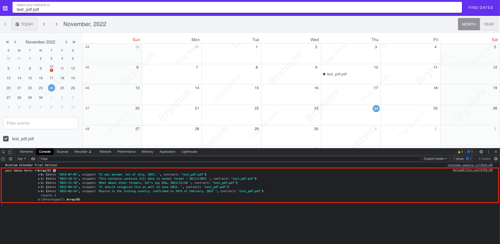

# Harbour "Contract dates visualization (Frontend)"

### Tech task by Andrii Orlov

## Demo

You can try it out by the link: https://harbour-front-cpjco.ondigitalocean.app/


P.S. if you want to know which dates were parsed from pdf(-s), just open the console.



## Features

- Upload multiple contracts via UI
- Responsive design
- Date visualisation using calendar
- Ability to check the text snippet where the date has been parsed from
- Ability to check the original contract
- Ability to filter dates on the Calendar by checking/unchecking contracts they belong to

## Installation

It is better to use Dockerfile since everything is predefined there and any problems with running server should not be
raised
Commands to run (all from the project's root directory):

```sh
docker build -t harbour_front .
docker run -it -p 8080:80 --rm harbour_front
```

!important: if you would like to install project locally, keep in mind that I've used bryntum calendar, which requires
logging into private repo. You won't be able to do this unless I'll provide you with password or token.

!important 2: it might take some time to build the docker image, but that's because of the `--platform=linux/amd64`.
It was written I should add it in case of using Mac with M1 processor and deploying to DigitalOcean.
You can try to delete it if needed

## Linters

I've used 2 linters here: Elsint + Prettier. They were attached to the IDE, so no need to run any commands.
